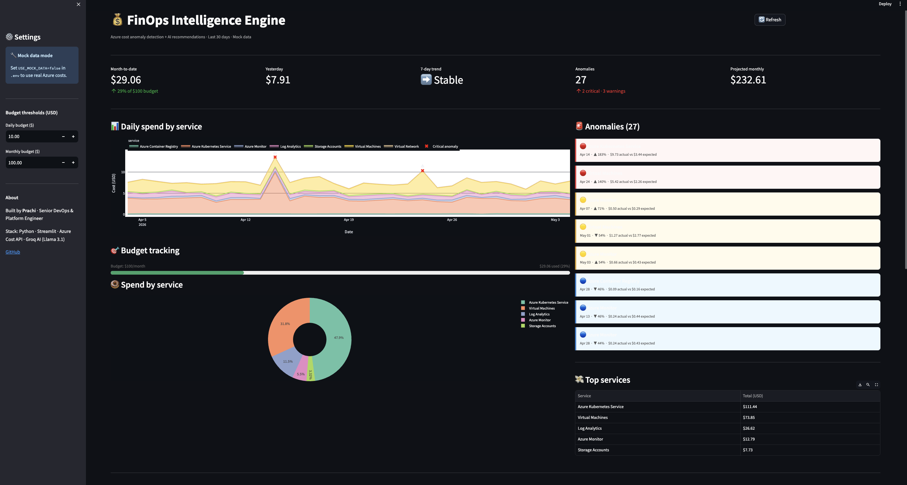
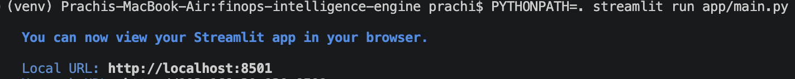
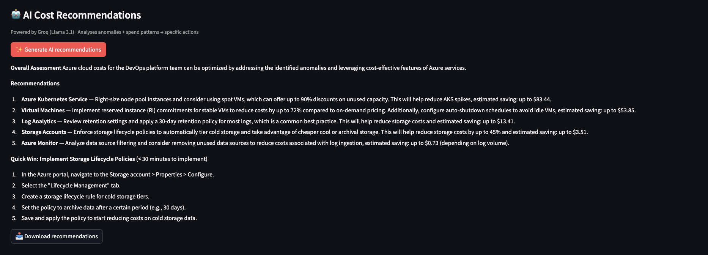
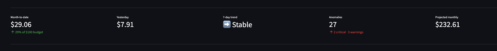
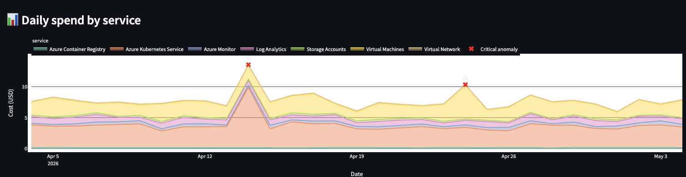
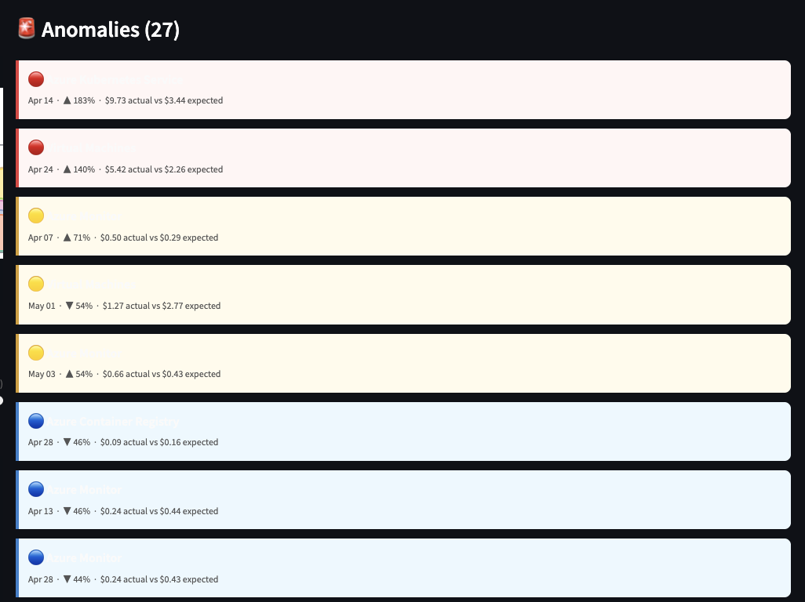

# FinOps Intelligence Engine

> Real-time Azure cost anomaly detection with AI-powered recommendations.
> Detects spend spikes using rolling statistical analysis, then uses Groq AI (Llama 3.1)
> to generate specific, actionable optimisation advice — not just alerts.
> Built as a custom dashboard instead of Azure Defender for Cloud — here's why.


---

## Why build this instead of using Azure's built-in tools?

This is the first question anyone will ask — and it's a fair one.

Azure already gives you:
- **Budget alerts** — email when your spend hits a threshold (e.g. $80 of $100)
- **Cost Management dashboards** — view spend by service, resource group, date
- **Defender for Cloud** — security recommendations + some cost insights (~$15/server/month)

**So why build a custom tool?**

### What Azure budget alerts actually do

```
Month-to-date spend hit $80 of your $100 budget.
→ You get an email.
```

That's it. You know you're close to the limit. You don't know:
- Which service caused the spike
- Whether it's a one-off anomaly or a trend
- Whether it happened yesterday or slowly over 3 weeks
- What specifically to do about it

### What this dashboard does differently

```
Azure Kubernetes Service spiked 280% on Apr 20
($10.50 actual vs $3.50 expected 7-day baseline)

AI recommendation:
"Your AKS node pool ran at 8% CPU for 3 days.
Switch non-critical workloads to spot instances —
up to 80% saving. Run kubectl top pods to identify
over-requested containers."
```

You know **which service**, **when**, **how much**, and **exactly what to do**.

### Side-by-side comparison

| | Azure Budget Alert | Azure Defender | This project |
|---|---|---|---|
| **"Am I near my limit?"** | ✅ | ✅ | ✅ |
| **"Which service spiked?"** | ❌ | ⚠️ Basic | ✅ Per-service, per-day |
| **"Is this anomalous?"** | ❌ | ❌ | ✅ Rolling baseline comparison |
| **"What do I do about it?"** | ❌ | ⚠️ Generic | ✅ AI-specific to your stack |
| **"When exactly did it spike?"** | ❌ | ❌ | ✅ Exact date + deviation % |
| **Cost** | Free | ~$15/server/month | Free — runs in existing cluster |
| **Customisable thresholds** | ❌ | ❌ | ✅ Via config |
| **Portable to other clouds** | ❌ | ❌ | ✅ Swap cost_fetcher.py |

**The one-line answer:**
> Azure budget alerts tell you *that* you overspent.
> This tells you *why* and *exactly what to do about it* — automatically, daily, before you hit the limit.

For a Senior DevOps engineer, understanding how anomaly detection works and being able
to extend it is more valuable than clicking through a vendor dashboard.

---

## What problem this solves

Cloud bills spike silently. Teams find out at month-end when nothing can be done.
This engine detects anomalies daily, explains them in plain English, and suggests
specific fixes — before the invoice lands.

Built from real experience at Capgemini where cost optimisation was done manually
via Datadog dashboards at the end of each sprint. This automates that process and
adds an AI reasoning layer on top.

---

## Architecture

```
Azure Cost Management API (or mock data for local dev)
         │
         ▼
  cost_fetcher.py         Pulls daily cost data per service
         │
         ▼
  anomaly_detector.py     Rolling 7-day average + threshold detection
         │                Classifies: critical / warning / info
         ▼
  ai_advisor.py           Sends context to Groq API (Llama 3.1)
         │                Returns specific, actionable recommendations
         ▼
  main.py (Streamlit)     Dashboard: KPI metrics + charts + anomaly cards + AI panel
         │
         ▼
  AKS (Phase 2)           Deployed as pod via ArgoCD GitOps
         │
         ▼
  devops-platform-foundation cluster
         ├── Prometheus scrapes finops pod metrics
         └── Grafana shows cost metrics alongside cluster metrics
```


---

## Dashboard features

- **KPI metrics** — month-to-date spend, yesterday, 7-day trend, anomaly count, projected monthly
- **Daily spend chart** — stacked area chart per service with critical anomaly markers
- **Budget tracking** — visual progress bar against daily and monthly budgets
- **Service breakdown** — pie chart of top cost drivers
- **Anomaly cards** — colour-coded critical / warning / info with deviation details
- **AI recommendations** — Groq AI analyses anomalies and returns specific actions
- **CSV export** — download raw cost data
- **Recommendations export** — download AI advice as markdown



---

## Repository structure

```
finops-intelligence-engine/
├── app/
│   ├── __init__.py
│   ├── config.py            All settings — reads from .env
│   ├── cost_fetcher.py      Azure Cost API client + mock data generator
│   ├── anomaly_detector.py  Rolling average detection + severity classification
│   ├── ai_advisor.py        Groq API integration + rule-based fallback
│   └── main.py              Streamlit dashboard
├── images/                  Screenshots for README
├── k8s/
│   └── manifests.yaml       AKS deployment (Phase 2)
├── mock_data/               Auto-generated test data (gitignored)
├── tests/
│   └── test_anomaly_detector.py
├── .github/workflows/
│   └── finops-ci-cd.yml     CI/CD pipeline
├── Dockerfile
├── requirements.txt
├── .env.example
├── .gitignore
└── README.md
```

---

## Phase 1 — Local setup (start here)

### Prerequisites

```bash
# Python 3.9+ required
python3 --version

# Mac — install tools
brew install git python3
```

### Step 1 — Get a free Groq API key

1. Go to [console.groq.com](https://console.groq.com)
2. Sign up free — no credit card required
3. Go to **API Keys → Create key**
4. Copy the key (starts with `gsk_...`)

**Why Groq?** Completely free, no credit card, fast inference (Llama 3.1 8B),
OpenAI-compatible API. Perfect for learning projects.

### Step 2 — Clone and set up

```bash
git clone https://github.com/vmprachi7/finops-intelligence-engine.git
cd finops-intelligence-engine

# Create virtual environment
python3 -m venv venv
source venv/bin/activate

# Install dependencies
pip install -r requirements.txt
```

### Step 3 — Create .env file

```bash
cp .env.example .env
```

Open `.env` and set your Groq key:

```bash
GROQ_API_KEY=gsk_your-key-here
USE_MOCK_DATA=true    # keeps this true — no Azure account needed locally
```

Everything else can stay as default.

### Step 4 — Create mock_data folder

```bash
mkdir -p mock_data
```

The app auto-generates 30 days of realistic Azure cost data on first run —
including deliberate spikes for demo purposes.

### Step 5 — Run the dashboard

```bash
# PYTHONPATH=. is required — tells Python where to find the app/ module
PYTHONPATH=. streamlit run app/main.py
```

Open **http://localhost:8501**




### Step 6 — Run tests

```bash
USE_MOCK_DATA=true pytest tests/ -v
# Expected: 13 tests, all passing
```

### Step 7 — Test AI recommendations

Click **"✨ Generate AI recommendations"** in the dashboard.

Groq AI (Llama 3.1) will analyse the mock anomalies and return specific,
actionable advice within 2–3 seconds.



---

## What you see in the dashboard

### KPI metrics row

| Metric | What it shows |
|---|---|
| Month-to-date | Total spend this month vs budget |
| Yesterday | Previous day's total spend |
| 7-day trend | Up / Down / Stable vs prior 7 days |
| Anomalies | Count with critical/warning breakdown |
| Projected monthly | Daily average × 30 |




### Daily spend chart

Stacked area chart showing spend per Azure service over 30 days.
Critical anomaly dates are marked with red ✕ markers.




### Anomaly cards

Colour-coded by severity:
- 🔴 **Critical** — deviation > 100% from rolling average
- 🟡 **Warning** — deviation > 50%
- 🔵 **Info** — deviation > 30% (configurable threshold)

Each card shows: service name, date, actual vs expected cost, deviation %.



### AI recommendations

Groq AI receives the full cost context — anomalies, top services, trend,
MTD spend — and returns specific recommendations for each affected service.

Not "your AKS cost increased." More like:
"Your AKS node pool ran at 8% CPU utilisation for 3 days. Switch non-critical
workloads to spot instances for up to 80% saving. Run kubectl top pods to
identify over-requested containers."


---

## Phase 2 — Connect real Azure cost data

### Add Cost Management Reader role to your Service Principal

```bash
az role assignment create \
  --assignee "YOUR_SP_APP_ID" \
  --role "Cost Management Reader" \
  --scope "/subscriptions/YOUR_SUBSCRIPTION_ID"

# Verify
az role assignment list --assignee "YOUR_SP_APP_ID" --output table
```

### Update .env

```bash
USE_MOCK_DATA=false
AZURE_SUBSCRIPTION_ID=your-subscription-id
AZURE_TENANT_ID=your-tenant-id
AZURE_CLIENT_ID=your-sp-appId
AZURE_CLIENT_SECRET=your-sp-password
GROQ_API_KEY=gsk_your-key-here
```

Restart the dashboard — now showing real Azure costs.

---

## Phase 3 — Deploy to AKS

### Prerequisites

- Platform foundation cluster running (`devops-platform-aks`)
- ACR provisioned (`devopsplatformacr`)
- `kubectl` configured pointing at the cluster

### Step 1 — Build and push Docker image

```bash
az acr login --name devopsplatformacr

docker build -t devopsplatformacr.azurecr.io/finops-engine:latest .
docker push devopsplatformacr.azurecr.io/finops-engine:latest
```

### Step 2 — Create secrets in cluster

```bash
kubectl create namespace finops-engine

kubectl create secret generic finops-secrets \
  --namespace finops-engine \
  --from-literal=AZURE_SUBSCRIPTION_ID=your-sub-id \
  --from-literal=AZURE_TENANT_ID=your-tenant-id \
  --from-literal=AZURE_CLIENT_ID=your-client-id \
  --from-literal=AZURE_CLIENT_SECRET=your-client-secret \
  --from-literal=GROQ_API_KEY=gsk_your-key
```

### Step 3 — Deploy via kubectl

```bash
kubectl apply -f k8s/manifests.yaml
kubectl get pods -n finops-engine -w
```

### Step 4 — Access the dashboard

```bash
kubectl port-forward svc/finops-engine -n finops-engine 8080:80
# Open: http://localhost:8080
```

### Step 5 — Register in ArgoCD (GitOps)

In the platform repo, `gitops/argocd-apps/finops-engine.yaml` already
points to this repo. Apply it once:

```bash
kubectl apply -f ../devops-platform-foundation/gitops/argocd-apps/finops-engine.yaml
```

After this, every push to `k8s/manifests.yaml` in this repo auto-deploys
via ArgoCD. No manual kubectl needed.

<!-- 📸 Add after AKS deployment -->

---

## Push to GitHub

```bash
# From repo root
cd finops-intelligence-engine

# Check nothing sensitive is being committed
git status
# .env should NOT appear — it's in .gitignore
# mock_data/sample_costs.json should NOT appear — it's in .gitignore

# Stage everything
git add .

# First commit
git commit -m "feat: FinOps Intelligence Engine — local working version with Groq AI"

# Push
git push origin main
```

**Before pushing — verify your .gitignore is working:**

```bash
git check-ignore -v .env
# Should output: .gitignore:2:.env   .env
# If it doesn't output anything, your .env would be committed — stop and fix .gitignore first
```

---

## GitHub Actions CI/CD

The pipeline in `.github/workflows/finops-ci-cd.yml`:

| Job | Trigger | What it does |
|---|---|---|
| `test` | Every push + PR | Runs pytest with mock data |
| `build-push` | Merge to main | Builds Docker image, pushes to ACR with short SHA tag |
| `deploy` | Merge to main | Applies k8s manifests, updates image tag, waits for rollout |

### Secrets required in GitHub

| Secret | Source |
|---|---|
| `ARM_CLIENT_ID` | SP appId |
| `ARM_CLIENT_SECRET` | SP password |
| `ARM_TENANT_ID` | tenant ID |
| `ARM_SUBSCRIPTION_ID` | subscription ID |
| `GROQ_API_KEY` | from console.groq.com (free) |

OIDC authentication — no `AZURE_CREDENTIALS` JSON secret needed.
See [devops-platform-foundation](https://github.com/vmprachi7/devops-platform-foundation)
for federated credential setup.

---

## Anomaly detection — how it works

**Method:** Rolling 7-day average + percentage deviation threshold.

```python
rolling_mean = cost.shift(1).rolling(window=7, min_periods=3).mean()
deviation_pct = (actual - rolling_mean) / rolling_mean * 100

if abs(deviation_pct) > ANOMALY_THRESHOLD_PCT:  # default 30%
    flag_as_anomaly()
```

**Why this over an ML model:**
- Transparent — you can see exactly why a day was flagged
- No training data needed
- Tunable via config — change threshold without code changes
- Easy to explain in an interview or to a stakeholder
- False positives have real consequences — a black-box model is harder to trust

**Severity classification:**
- `critical` — deviation > 100%
- `warning` — deviation > 50%
- `info` — deviation > 30% (configurable)

---

## Architecture Decision Records

### ADR-001: Streamlit over Flask/FastAPI

Streamlit renders DataFrames, Plotly charts, and markdown natively with zero
frontend code. For a data dashboard with ~10 concurrent users, this means
100% focus on logic. Trade-off: not suitable for high-concurrency production.

### ADR-002: Rolling average over ML model

Cost data has low dimensionality and clear seasonal patterns. Statistical
approach is transparent and tunable without retraining. Trade-off: misses
slow-drift anomalies (5%/day increase over weeks).

### ADR-003: Groq over OpenAI/Anthropic

Completely free — no credit card, no limits for learning projects.
Llama 3.1 8B produces specific, actionable recommendations for this use case.
Same OpenAI-compatible API — one line change to swap providers.
Trade-off: smaller context window than GPT-4o.

### ADR-004: Custom dashboard over Azure Defender for Cloud

Azure Defender costs ~$15/server/month. This runs free in the existing cluster.
Custom thresholds, AI-generated specific advice, and full code ownership.
Portable to any cloud by swapping `cost_fetcher.py`.
Trade-off: requires maintenance; Defender is managed by Microsoft.

---

## Interview talking points

**On the build decision:**
> "Azure Defender for Cloud exists. I built this anyway because Defender tells
> you *that* your cost increased — this tells you *exactly what to do about it*.
> The AI layer is the differentiator. And it runs free in the existing cluster
> vs $15/server/month for Defender."

**On anomaly detection:**
> "I chose rolling 7-day average over an ML model deliberately. The logic is
> transparent — a senior engineer can look at it and understand exactly why a
> day was flagged. For cost alerts where false positives have real consequences,
> explainability matters more than sophistication."

**On the AI layer:**
> "The AI doesn't just repeat the anomaly back to you. It reasons about the
> specific service — AKS spike means spot instances, storage spike means
> lifecycle policies. The recommendations are specific and actionable, not
> generic. And it uses Groq's free tier — no API cost at all."

**On deployment:**
> "It runs as a pod in the same AKS cluster as the platform foundation.
> Deployed via ArgoCD — I push a manifest change to GitHub and ArgoCD syncs
> it automatically. The CI/CD pipeline builds the Docker image, pushes to ACR,
> and updates the deployment. Zero manual kubectl."

---

## Projects in this portfolio

| Repo | What it does | Status |
|---|---|---|
| [devops-platform-foundation](https://github.com/vmprachi7/devops-platform-foundation) | AKS + GitOps + Observability | ✅ Complete |
| [finops-intelligence-engine](https://github.com/vmprachi7/finops-intelligence-engine) | Azure cost anomaly detection + AI | ✅ This repo |
| agentic-aiops | Autonomous observability + runbook AI | 🔜 Planned |

---

*Built by Prachi · Senior DevOps & Platform Engineer*
*[LinkedIn](https://www.linkedin.com/in/prachi-v/) · [GitHub](https://github.com/vmprachi7)*