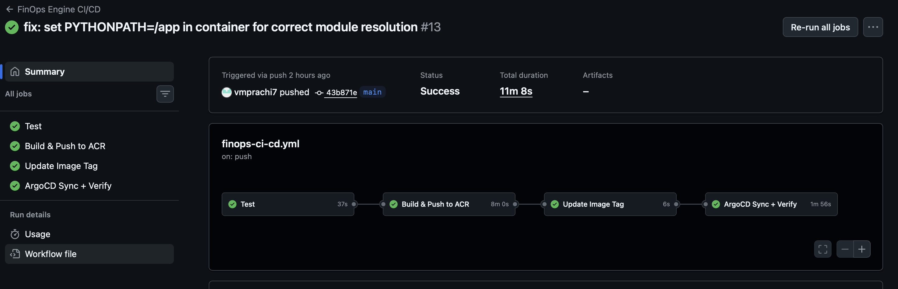
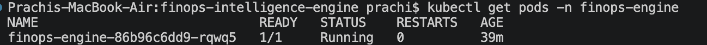
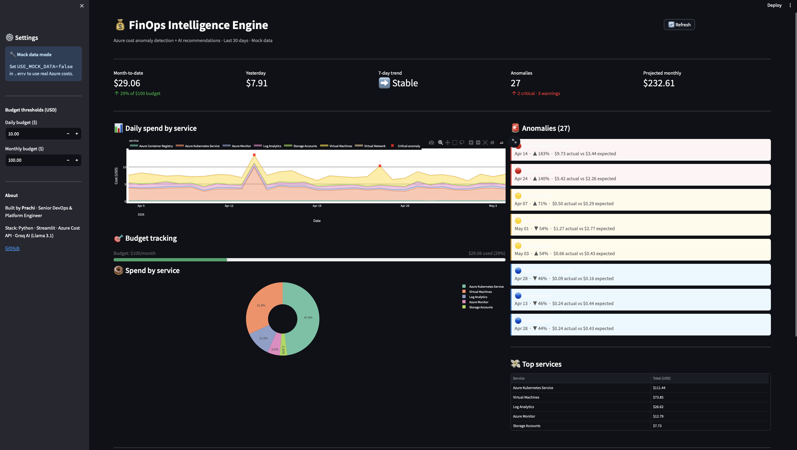
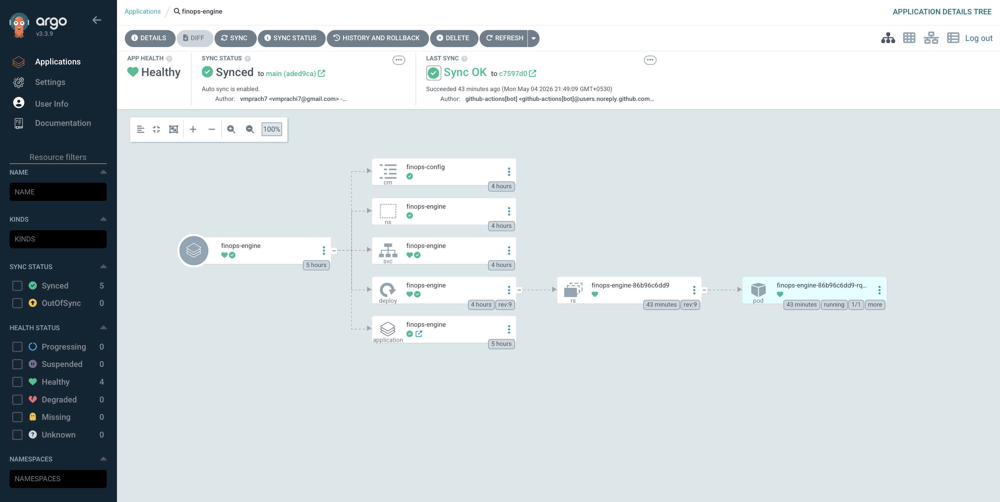
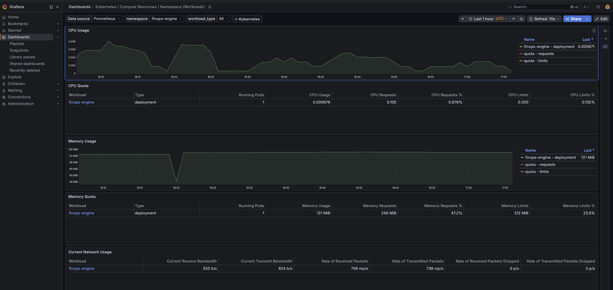
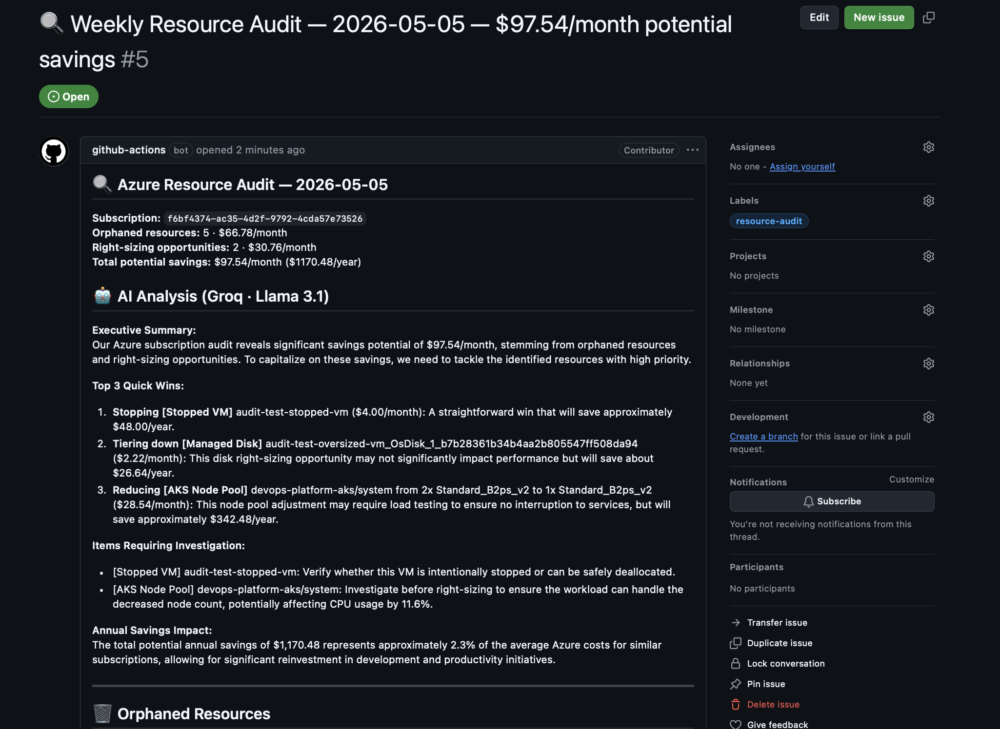

# FinOps Intelligence Engine

> Real-time Azure cost anomaly detection with AI-powered recommendations.
> Detects spend spikes using rolling statistical analysis, then uses Groq AI (Llama 3.1)
> to generate specific, actionable optimisation advice — not just alerts.
> Built as a custom dashboard instead of Azure Defender for Cloud — here's why.


---

## Why build this instead of using Azure's built-in tools?

Azure already gives you budget alerts, Cost Management dashboards, and Defender for Cloud.

**So why build a custom tool?**

### What Azure budget alerts actually do

```
Month-to-date spend hit $80 of your $100 budget.
→ You get an email.
```

That's it. You know you're close to the limit. You don't know which service caused it,
whether it's a one-off anomaly, when exactly it happened, or what to do about it.

### What this does differently

```
Azure Kubernetes Service spiked 280% on Apr 20
($10.50 actual vs $3.50 expected 7-day baseline)

AI recommendation:
"Your AKS node pool ran at 8% CPU for 3 days.
Switch non-critical workloads to spot instances —
up to 80% saving."
```

### Side-by-side comparison

| | Azure Budget Alert | Azure Defender | This project |
|---|---|---|---|
| **"Am I near my limit?"** | ✅ | ✅ | ✅ |
| **"Which service spiked?"** | ❌ | ⚠️ Basic | ✅ Per-service, per-day |
| **"Is this anomalous?"** | ❌ | ❌ | ✅ Rolling baseline |
| **"What do I do about it?"** | ❌ | ⚠️ Generic | ✅ AI-specific advice |
| **Right-sizing suggestions** | ❌ | ❌ | ✅ VM + AKS + disk |
| **Automated weekly audit** | ❌ | ❌ | ✅ GitHub Issue trail |
| **Cost** | Free | ~$15/server/month | Free — runs in existing cluster |

> Azure budget alerts tell you *that* you overspent.
> This tells you *why*, *what to do*, and *what to clean up* — automatically.

---

## Three capabilities in one repo

```
1. DASHBOARD        Real-time anomaly detection + AI recommendations
2. RESOURCE AUDITOR Weekly scan — orphaned assets + right-sizing
3. GITOPS DEPLOY    Pod in AKS, deployed via ArgoCD
```

---

## Architecture

```
Azure Cost Management API (or mock data)
         │
         ▼
  cost_fetcher.py        Pulls daily cost data per service
         │
         ▼
  anomaly_detector.py    Rolling 7-day average + threshold detection
         │
         ▼
  ai_advisor.py          Groq API (Llama 3.1) → specific recommendations
         │
         ▼
  main.py (Streamlit)    Dashboard: KPIs + charts + anomaly cards + AI panel
         │
         ▼
  AKS (finops-engine)    Pod in devops-platform-foundation cluster
         ├── ArgoCD watches repo → auto-deploys on push
         └── Prometheus + Grafana monitoring

  resource_auditor.py    Runs weekly via GitHub Actions cron
         │
         ▼
  GitHub Issue           AI-prioritised report every Sunday
```

---

## Repository structure

```
finops-intelligence-engine/
├── app/
│   ├── config.py              Settings — reads from .env
│   ├── cost_fetcher.py        Azure Cost API + mock data
│   ├── anomaly_detector.py    Detection + severity
│   ├── ai_advisor.py          Groq AI + rule-based fallback
│   ├── main.py                Streamlit dashboard
│   └── resource_auditor.py    Weekly orphaned + right-sizing auditor
├── images/                    Screenshots
├── k8s/manifests.yaml         AKS deployment (linux/arm64)
├── tests/
├── .github/workflows/
│   ├── finops-ci-cd.yml       Build + deploy pipeline
│   └── resource-audit.yml     Weekly cron auditor
├── create-test-resources.sh   Creates orphaned + oversized VMs for auditor demo
├── run-local-test.sh          Runs auditor locally with mock metrics
├── cleanup-test-resources.sh  Deletes all test resources
├── Dockerfile                 linux/arm64 — Standard_B2ps_v2 node
├── requirements.txt
└── .env.example
```

---

## Phase 1 — Local setup

### Prerequisites

```bash
python3 --version   # 3.9+ required
brew install git python3
```

### Step 1 — Get a free Groq API key

1. Go to [console.groq.com](https://console.groq.com)
2. Sign up free — no credit card required
3. **API Keys → Create key** → copy key starting with `gsk_...`

### Step 2 — Clone and set up

```bash
git clone https://github.com/vmprachi7/finops-intelligence-engine.git
cd finops-intelligence-engine

python3 -m venv venv
source venv/bin/activate
pip install -r requirements.txt
```

### Step 3 — Create .env

```bash
cp .env.example .env
# Set:
GROQ_API_KEY=gsk_your-key-here
USE_MOCK_DATA=true
```

### Step 4 — Create mock_data folder

```bash
mkdir -p mock_data
```

### Step 5 — Run the dashboard

```bash
PYTHONPATH=. streamlit run app/main.py
# Open: http://localhost:8501
```

<!-- 📸 SCREENSHOT 1 → images/local-terminal.png -->
<!-- Take: Terminal showing streamlit running -->


### Step 6 — Run tests

```bash
USE_MOCK_DATA=true pytest tests/ -v
```

### Step 7 — Explore the dashboard

<!-- 📸 SCREENSHOT 2 → images/dashboard-overview.png -->
<!-- Take: Full dashboard — KPI row + area chart + anomaly cards visible -->


<!-- 📸 SCREENSHOT 3 → images/kpi-metrics.png -->
<!-- Take: Just the KPI metrics row at the top -->


<!-- 📸 SCREENSHOT 4 → images/area-chart.png -->
<!-- Take: Daily spend area chart with red anomaly markers -->


<!-- 📸 SCREENSHOT 5 → images/anomaly-cards.png -->
<!-- Take: Right panel showing red/yellow/blue anomaly cards -->


### Step 8 — Generate AI recommendations

Click **"✨ Generate AI recommendations"**

<!-- 📸 SCREENSHOT 6 → images/ai-recommendations.png -->
<!-- Take: AI recommendations panel showing Groq response text -->


### Step 9 — Push to GitHub

```bash
git check-ignore -v .env   # confirm .env is ignored
git add .
git commit -m "feat: FinOps Intelligence Engine — local working version"
git push origin main
```

---

## Phase 2 — Connect real Azure cost data

### Add Cost Management Reader role

```bash
az role assignment create \
  --assignee "YOUR_SP_APP_ID" \
  --role "Cost Management Reader" \
  --scope "/subscriptions/YOUR_SUBSCRIPTION_ID"
```

### Update .env

```bash
USE_MOCK_DATA=false
AZURE_SUBSCRIPTION_ID=your-subscription-id
AZURE_TENANT_ID=your-tenant-id
AZURE_CLIENT_ID=your-sp-appId
AZURE_CLIENT_SECRET=your-sp-password
GROQ_API_KEY=gsk_your-key-here
```

Restart the dashboard — now showing real Azure costs.

---

## Phase 3 — Deploy to AKS via GitOps

### Architecture note

The cluster uses `Standard_B2ps_v2` (ARM/Ampere Altra processor — `p` = ARM).
Image must be `linux/arm64`. Building `linux/amd64` causes `exec format error`.

### Step 1 — One-time cluster setup

```bash
# Env vars already in ~/.zshrc from platform setup
# Add Groq key if not already there:
echo 'export GROQ_API_KEY="gsk_your-key"' >> ~/.zshrc && source ~/.zshrc

bash one-time-setup.sh
```

Creates: namespace, ACR pull secret, app secrets, ArgoCD registration, OIDC credentials.

### Step 2 — Add GitHub Secrets

| Secret | How to get |
|---|---|
| `ARM_CLIENT_ID` | `az ad sp show --display-name terraform-sp --query appId -o tsv` |
| `ARM_CLIENT_SECRET` | saved when SP was created |
| `ARM_TENANT_ID` | `az account show --query tenantId -o tsv` |
| `ARM_SUBSCRIPTION_ID` | `az account show --query id -o tsv` |
| `GROQ_API_KEY` | from console.groq.com |

### Step 3 — Add OIDC federated credentials

**portal.azure.com → App registrations → terraform-sp →
Certificates & secrets → Federated credentials → Add credential**

| Name | Entity | Value |
|---|---|---|
| `github-finops-main` | Branch | `main` |
| `github-finops-pr` | Pull request | — |
| `github-finops-production` | Environment | `production` |

### Step 4 — Push to trigger deployment

```bash
git push origin main
```

```
test → build linux/arm64 → push to ACR
     → update image tag in manifest
     → ArgoCD sync → pod rolling update
```

<!-- 📸 SCREENSHOT 7 → images/github-actions-green.png -->


### Step 5 — Verify pod running

```bash
kubectl get pods -n finops-engine
```

<!-- 📸 SCREENSHOT 8 → images/aks-pod-running.png -->


### Step 6 — Access dashboard on AKS

```bash
kubectl port-forward svc/finops-engine -n finops-engine 8081:80
# Open: http://localhost:8081
```

<!-- 📸 SCREENSHOT 9 → images/dashboard-aks.png -->


### Step 7 — Verify in ArgoCD

```bash
kubectl port-forward svc/argocd-server -n argocd 8080:443
# https://localhost:8080 → finops-engine: Synced + Healthy
```

<!-- 📸 SCREENSHOT 10 → images/argocd-synced.png -->


### Step 8 — Verify in Grafana

```bash
kubectl port-forward -n monitoring \
  svc/kube-prometheus-stack-grafana 3000:80
# http://localhost:3000
# Dashboards → Kubernetes/Compute Resources/Namespace → finops-engine
```

<!-- 📸 SCREENSHOT 11 → images/grafana-finops.png -->


---

## Testing the auditor

Three scripts to create real Azure resources and verify the auditor works.

### Create test resources

```bash
bash create-test-resources.sh
```

Creates in East US 2:
- 2 unattached Premium disks (128GB + 256GB)
- 1 unassigned public IP
- 1 empty resource group
- 1 stopped VM (deallocated)
- 1 oversized running VM (`Standard_D2as_v7`)

Total expected findings: ~$89/month

### Run auditor locally

```bash
bash run-local-test.sh
```

Runs with `MOCK_METRICS=true` — simulates 8% avg CPU so right-sizing
works immediately without waiting 7 days for Azure Monitor data.

### Clean up

```bash
bash cleanup-test-resources.sh
```

### Run via GitHub Actions

**Actions → Resource Audit → Run workflow → dry_run: false**

Creates a real GitHub Issue with all findings.

<!-- 📸 SCREENSHOT 12 → images/audit-issue.png -->
[Visit issue](https://github.com/vmprachi7/finops-intelligence-engine/issues/5)


---

## Phase 4 — Weekly Resource Auditor

Runs every Sunday at 9:00 AM UTC. Posts AI-prioritised report as a GitHub Issue.

### What it detects

**Orphaned resources:**
- Unattached managed disks
- Unassigned public IPs
- Empty resource groups
- Stopped VMs (still paying for OS disk)
- Load balancers with no backend members

**Right-sizing opportunities (7-day avg metrics):**
- VMs with avg CPU < 20% → suggests smaller SKU with real pricing
- AKS node pools with avg CPU < 30% → suggests fewer nodes
- Premium SSD with low IOPS → suggests Standard SSD

### Run a dry run first

**Actions → Resource Audit → Run workflow → dry_run: true**

Prints the report in logs. No Issue created.

### Run for real

**Actions → Resource Audit → Run workflow → dry_run: false**

### What the Issue looks like

```
🔍 Weekly Resource Audit — 2026-05-04 — $42.01/month potential savings

Orphaned: 3 resources · $23.36/month
Right-sizing: 2 · $18.65/month

🤖 AI Analysis: Top quick win: delete unattached 256GB Premium
disk in devops-platform-rg ($39.42/month saving)...

## 🗑️ Orphaned Resources
## 📐 Right-Sizing Recommendations
```

The Issues tab builds an audit history — every Sunday, automatically.

---

## GitHub Actions pipelines

| Pipeline | Trigger | What it does |
|---|---|---|
| `finops-ci-cd.yml` | Push to main | test → build arm64 → update manifest → ArgoCD sync |
| `resource-audit.yml` | Every Sunday + manual | audit → AI analysis → GitHub Issue |

---

## Anomaly detection — how it works

```python
rolling_mean  = cost.shift(1).rolling(window=7, min_periods=3).mean()
deviation_pct = (actual - rolling_mean) / rolling_mean * 100

if abs(deviation_pct) > ANOMALY_THRESHOLD_PCT:   # default 30%
    flag_as_anomaly()
```

**Why rolling average over ML:** transparent, no training data, tunable via config,
false positives have consequences — explainability matters more than sophistication.

---

## Architecture Decision Records

### ADR-001: Streamlit over Flask/FastAPI
Zero frontend code for a data dashboard. Trade-off: not for high-concurrency.

### ADR-002: Rolling average over ML model
Transparent and tunable. Trade-off: misses slow-drift anomalies.

### ADR-003: Groq over OpenAI/Anthropic
Completely free, no credit card, OpenAI-compatible API.

### ADR-004: Custom dashboard over Azure Defender
Free vs ~$15/server/month. AI-specific advice, portable to any cloud.

### ADR-005: linux/arm64 for Standard_B2ps_v2
`p` in B2ps_v2 = ARM processor. amd64 causes exec format error at runtime.

---
## ⚠️ Security Notice — Groq API in Production

This project uses [Groq's free tier](https://console.groq.com) for AI recommendations.
This is appropriate for learning, portfolio projects, and internal tooling.

**For production use, consider the following:**

### What the concern is

When you send cost data to Groq's API, that data leaves your environment and is
processed by a third-party service. For most teams, cost anomaly summaries and
resource names are not sensitive. But for organisations with strict data residency
requirements or compliance obligations (SOC 2, ISO 27001, HIPAA), sending any
cloud metadata to an external API may not be acceptable.

### Production-ready alternatives

| Option | How | Trade-off |
|---|---|---|
| **Azure OpenAI Service** | Deploy GPT-4o inside your Azure tenant — data never leaves your subscription | Costs money, requires Azure OpenAI access approval |
| **Ollama (self-hosted)** | Run Llama 3.1 locally or on a VM inside your VNet | Free, fully private, but needs compute to run the model |
| **Prompt filtering** | Strip resource names/IDs before sending to Groq — send only cost numbers and service types | Reduces context quality but keeps sensitive data local |
| **Azure Private Endpoints** | If using Azure OpenAI, route all traffic through private endpoints | No public internet exposure |

### Swapping providers — one line change

The AI layer is intentionally provider-agnostic. Switching from Groq to
Azure OpenAI is a single change in `app/config.py`:

```python
# Current (Groq — free tier)
GROQ_API_KEY  = os.getenv("GROQ_API_KEY", "")
AI_MODEL      = "llama-3.1-8b-instant"

# Production (Azure OpenAI — data stays in your tenant)
AZURE_OPENAI_ENDPOINT = os.getenv("AZURE_OPENAI_ENDPOINT", "")
AZURE_OPENAI_KEY      = os.getenv("AZURE_OPENAI_KEY", "")
AI_MODEL              = "gpt-4o"
```

And in `app/ai_advisor.py`:

```python
# Switch base_url to your Azure OpenAI endpoint
client = OpenAI(
    api_key=os.getenv("AZURE_OPENAI_KEY"),
    base_url=f"{os.getenv('AZURE_OPENAI_ENDPOINT')}/openai/deployments/gpt-4o",
    default_headers={"api-key": os.getenv("AZURE_OPENAI_KEY")},
)
```

### Minimum recommended steps before going to production

1. **Store the Groq API key in Azure Key Vault** — not as a plain Kubernetes Secret
2. **Use External Secrets Operator** — sync Key Vault secrets into the cluster automatically
3. **Review what's in the prompt** — the current prompt sends service names and cost amounts, not resource IDs or subscription details
4. **Enable Groq's data privacy settings** — Groq offers options to opt out of training data usage in paid tiers

> **Bottom line:** For a portfolio project or internal FinOps tool, Groq free tier
> is perfectly reasonable. For a customer-facing or compliance-sensitive environment,
> use Azure OpenAI Service with private endpoints and Key Vault secret management.

---


## Interview talking points

**On build decision:**
> "Azure budget alerts tell you *that* you overspent. This tells you *why*, *what to do*, and runs a weekly audit for things you're paying for but not using."

**On anomaly detection:**
> "Rolling 7-day average — transparent, tunable, no ML model needed. For cost alerts, explainability matters more than sophistication."

**On right-sizing:**
> "The auditor pulls 7-day avg CPU from Azure Monitor. VMs below 20% get a specific smaller SKU recommendation with real pricing, not a generic suggestion."

**On the audit trail:**
> "Every Sunday a GitHub Issue is posted with AI-prioritised findings — orphaned resources and right-sizing opportunities with real pricing. Anyone can open the Issues tab and see the history. That's cost governance you can demonstrate."

**On ARM architecture:**
> "Debugged exec format error — Standard_B2ps_v2 is ARM (p = ARM in Azure naming). Built linux/arm64 to match the node. Always verify node architecture before choosing image platform."

---

## Screenshots reference

| # | File | When | What to capture |
|---|---|---|---|
| 1 | `images/terminal-running.png` | Phase 1 Step 5 | Terminal running streamlit |
| 2 | `images/dashboard-overview.png` | Phase 1 Step 7 | Full dashboard page |
| 3 | `images/kpi-metrics.png` | Phase 1 Step 7 | KPI metrics row only |
| 4 | `images/area-chart.png` | Phase 1 Step 7 | Spend area chart |
| 5 | `images/anomaly-cards.png` | Phase 1 Step 7 | Coloured anomaly cards |
| 6 | `images/ai-recommendations.png` | Phase 1 Step 8 | AI response text |
| 7 | `images/github-actions-green.png` | Phase 3 Step 4 | All 4 jobs green |
| 8 | `images/aks-pod-running.png` | Phase 3 Step 5 | Pod 1/1 Running |
| 9 | `images/dashboard-aks.png` | Phase 3 Step 6 | Dashboard on AKS |
| 10 | `images/argocd-synced.png` | Phase 3 Step 7 | ArgoCD Synced+Healthy |
| 11 | `images/grafana-finops.png` | Phase 3 Step 8 | Grafana namespace view |
| 12 | `images/audit-issue.png` | Phase 4 | GitHub Issue with report |

---

## Projects in this portfolio

| Repo | What it does | Status |
|---|---|---|
| [devops-platform-foundation](https://github.com/vmprachi7/devops-platform-foundation) | AKS + GitOps + Observability | ✅ Complete |
| [finops-intelligence-engine](https://github.com/vmprachi7/finops-intelligence-engine) | Cost detection + AI + auditor | ✅ This repo |
| agentic-aiops | Autonomous observability + runbook AI | 🔜 Planned |

---

*Built by Prachi · Senior DevOps & Platform Engineer*
*[LinkedIn](https://www.linkedin.com/in/prachi-v/) · [GitHub](https://github.com/vmprachi7)*